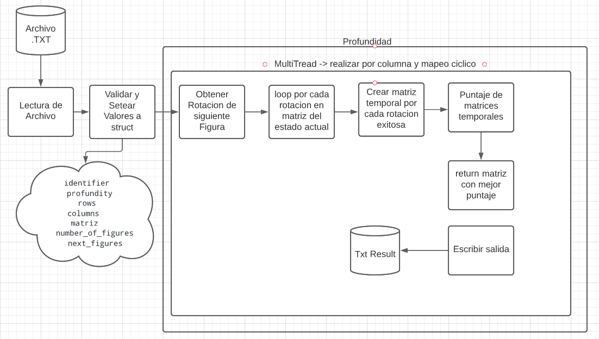
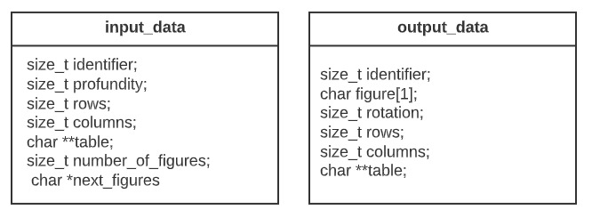
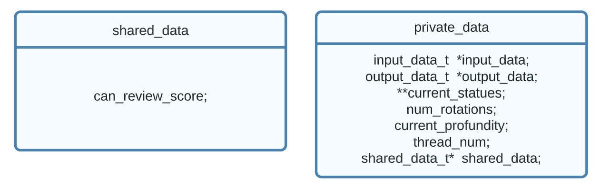
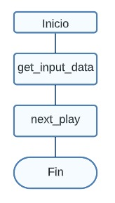
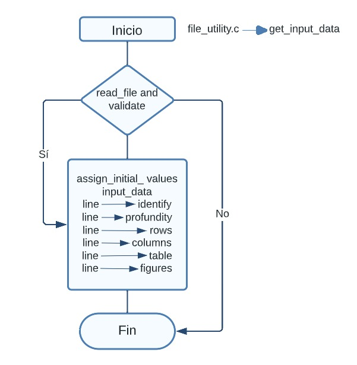
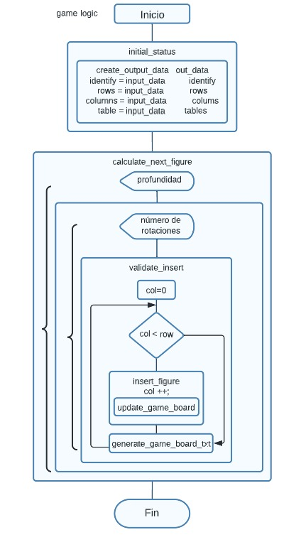

# Design

## Idea General del Proceso

Lluvia de ideas, de como se podria abarcar el problema y como se podria resolver de manera serial

Lluvia de ideas, de como se podria abarcar el problema y como se podria resolver con pthreads

## Diagrama UML

Structs utilizados en la tarea

## Diagrama de Flujo

### Diagrama Principal

Flujo del archivo main

### Diagrama de File Utility

Flujo del archivo file_utility, este archivo contiene toda la logica relacionada con el manejo de ficheros y setear los valores 

### Diagrama Game Logic

Flujo del archivo game_logic, este archivo contiene toda la logica relacionada con el manejo del juego (colocar la pieza, realizar intentos, etc..) de manera serial

Flujo del archivo game_logic, este archivo contiene toda la logica relacionada con el manejo del juego (colocar la pieza, realizar intentos, etc..)  con Pthreads

Cabe mencionar que también se realizaron pruebas en otros lenguajes de programación por ejemplo C#, adjunto la lógica referente al colocar una figura en el tablero de juego.