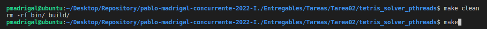

# Readme para ejecutar la Tarea 02

### Paso 1

Ejecutar los siguientes comandos en el root de la tarea (pablo-madrigal-concurrente-2022-I./Entregables/Tareas/Tarea02/tetris_solver_pthreads)
make clean
make

Puede utilizar make con alguno de los siguientes sanitazers asan, msan, tsan, ubsan. Por ejemplo: make msan

Ejecutar el siguiente comando en la carpeta bin de la tarea (pablo-madrigal-concurrente-2022-I./Entregables/Tareas/Tarea02/tetris_solver_pthreads/bin)
Puede utilizar el comando *cd bin* para llegar a la carpeta correspondiente desde el root de la tarea

Comando en la carpeta bin: ./tetris_solver_pthreads

Si no pone ningún parámetro al comando ./tetris_solver_pthreads, la tarea utilizará por defecto el siguiente archivo -> "../test/test01.txt"

Si requieres utilizar hilos, puedes utilizar el siguiente comando ./tetris_solver_pthreads "../test/test01.txt" {Cantidad de hilos}

Si no pone ningún parámetro al comando relacionado a hilos ./tetris_solver_pthreads, la tarea utilizará por defecto el valor sysconf(_SC_NPROCESSORS_ONLN);

Resultados

