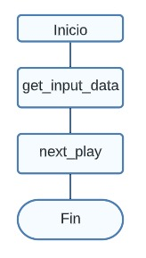

# Design

## Idea General del Proceso

Lluvia de ideas, de como se podria abarcar el problema y como se podria resolver con concurrencia

## Diagrama UML

Structs utilizados en la tarea

## Diagrama de Flujo

### Diagrama Principal

Flujo del archivo main

### Diagrama de File Utility

Flujo del archivo file_utility, este archivo contiene toda la logica relacionada con el manejo de ficheros y setear los valores 

### Diagrama Game Logic

Flujo del archivo game_logic, este archivo contiene toda la logica relacionada con el manejo del juego (colocar la pieza, realizar intentos, etc..) de manera serial

Flujo del archivo game_logic, este archivo contiene toda la logica relacionada con el manejo del juego (colocar la pieza, realizar intentos, etc..)  con openMp

No se puede implementar de forma ideonea la tecnologia mpi y openMP por la arquitectura de esta solucion pero, se opta por colocarla de la siguiente manera:

* MPI : se encarga de distribuir las figuras 
* OPENMP: se encarga de manejar la concurrencia en el proceso de colocar la figura.

Cabe mencionar que también se realizaron pruebas en otros lenguajes de programación por ejemplo C#, adjunto la lógica referente al colocar una figura en el tablero de juego.

### Comparacion entre diagrama de Flujo Tarea 1, 2 y 3

## Tarea 1

Lluvia de ideas, de como se podria abarcar el problema y como se podria resolver de manera serial

## Diagrama UML

Structs utilizados en la tarea

## Tarea 2

Lluvia de ideas, de como se podria abarcar el problema y como se podria resolver con concurrencia

## Tarea 3

## Diagrama UML

Structs utilizados en la tarea

## Comparacion

Como podemos apreciar previamente en los diagramas en la tarea 3 se sigue la tendencia de la la implementacion de la tarea #2, pero si tener que crear estructuras para la informacion privada y compartida que es requerida con pthreads, la tarea #3 utiliza la misma solucion con la tecnologia openMP.

### Reporte Sanitizers

De acuerdo a la informacion del Profesor en el momento de explicar la instruccion de codigo `#pragma omp critical`
se da un reporte de falso positivo en el momento de utilizar esa directiva para modificar una variable y evitar condiciones de carrera.

            #pragma omp critical
            {
                update_game_board(output_data, temp,
                                  num_rotations);
            }

