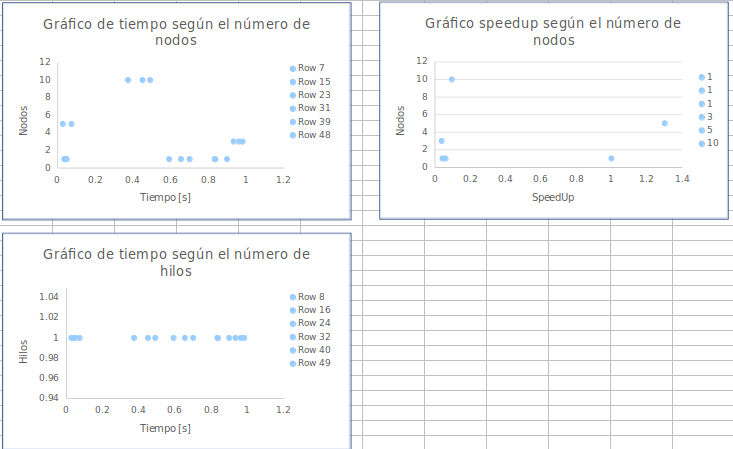
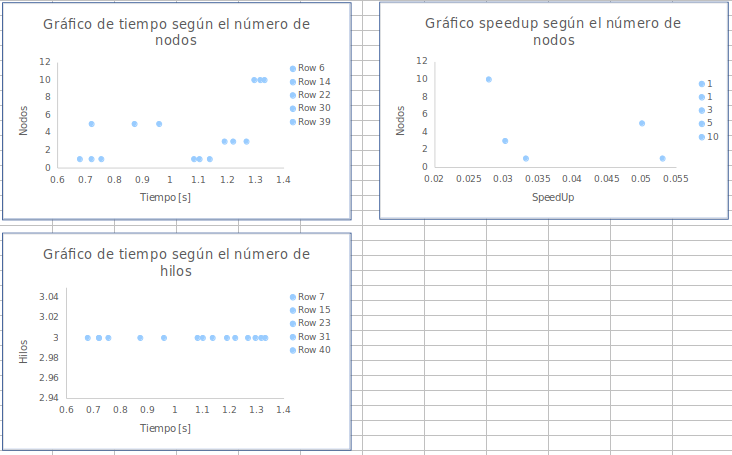
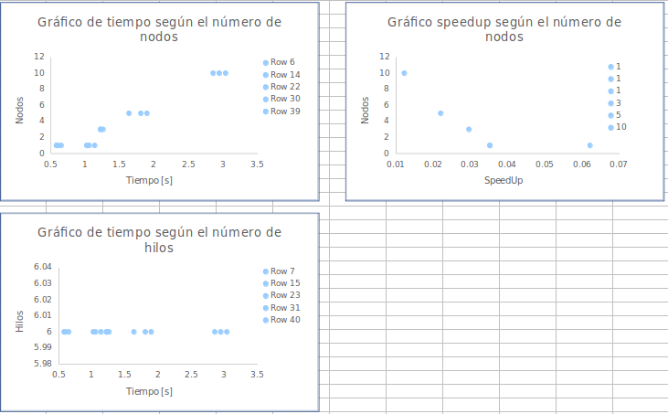
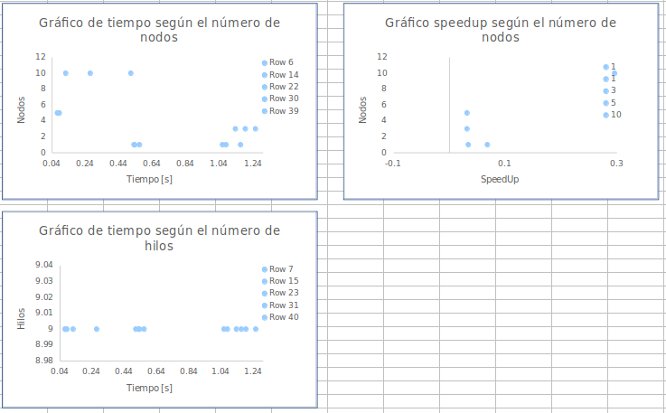

# Reporte

### Archivo tetris para las pruebas

```
1650259796944
12
20
10
0000000000
0000000000
0000000000
0000000000
0000000000
0000000000
0000000000
0000000000
0000000000
0000000000
0000000000
0001111000
0000040000
0004440000
0000700000
0007770000
0002200000
0020220000
0220066000
0777742244
14
I
Z
I
J
S
L
S
I
Z
I
J
S
L
S

```

### Resultados

* A. Usando un solo hilo (versión serial)

| Tarea           | Mejor Tiempo        | SpeedUp             | Nodos               |
|-----------------|---------------------|---------------------|---------------------|
| Tarea 1         | 0.036038181s        |           1         |         1           |
| Tarea 3         | 0.591868872s        |         0.0608      |        1            |
| Tarea 4         | 0.833007451s        |  0.0432             |         1           |
| Tarea 4         | 0.933319749s        |          0.0386     |         3           |
| Tarea 4         | 0.02768386 s        |         1.3017      |        5            |
| Tarea 4         | 0.373766286s        |  0.0964             |         10          |

* B. Usando 3 hilos

| Tarea           | Mejor Tiempo        | SpeedUp             | Nodos               |
|-----------------|---------------------|---------------------|---------------------|
| Tarea 3         | 0.678755887s        |         0.053       |        1            |
| Tarea 4         | 1.082333539s        |  0.0332             |         1           |
| Tarea 4         | 1.190325232s        |       0.0302        |         3           |
| Tarea 4         | 0.720267571s        |         0.05003     |        5            |
| Tarea 4         | 1.295232566s        |  0.02782            |         10          |

* C. Usando 6 hilos

| Tarea           | Mejor Tiempo        | SpeedUp             | Nodos               |
|-----------------|---------------------|---------------------|---------------------|
| Tarea 3         | 0.580205509s        |         0.0621      |        1            |
| Tarea 4         | 1.020994215s        |  0.0352             |         1           |
| Tarea 4         | 1.218224706s        |       0.02958       |         3           |
| Tarea 4         | 1.634638705s        |         0.022       |        5            |
| Tarea 4         | 2.944425702s        |  0.01223            |         10          |


* E. Usando 9 hilos

| Tarea           | Mejor Tiempo        | SpeedUp             | Nodos               |
|-----------------|---------------------|---------------------|---------------------|
| Tarea 3         | 0.529179147s        |         0.0681      |        1            |
| Tarea 4         | 1.057318726s        |  0.034              |         1           |
| Tarea 4         | 1.134426378s        |       0.0317        |         3           |
| Tarea 4         | 0.071671678s        |         0.03176     |        5            |
| Tarea 4         | 0.121797913s        |  0.2958             |         10          |


### Gráficos

En la siguiente comparativa utilizamos 1 hilo, es decir la version seria los resultados fueron los siguientes:
En la tarea #01 los tiempos fueron los siguientes:

| Hilos           | Tiempo              | Nodos               |
|-----------------|---------------------|---------------------|
| 1               | 0.036038181         |        1            |
| 1               | 0.036945317         |        1            |
| 1               | 0.049056329         |        1            |

En la tarea #03 los tiempos fueron los siguientes:

| Hilos           | Tiempo              | Nodos               |
|-----------------|---------------------|---------------------|
| 1               | 0.591868872         |        1            |
| 1               | 0.654285576         |        1            |
| 1               | 0.699903134         |        1            |

En la tarea #04 los tiempos fueron los siguientes:

| Hilos           | Tiempo              | Nodos               |
|-----------------|---------------------|---------------------|
| 1               | 0.833007451         |        1            |
| 1               | 0.83596275          |        1            |
| 1               | 0.898408411         |        1            |

| Hilos           | Tiempo              | Nodos               |
|-----------------|---------------------|---------------------|
| 1               | 0.933319749         |        3            |
| 1               | 0.96232713          |        3            |
| 1               | 0.981384316         |        3            |

| Hilos           | Tiempo              | Nodos               |
|-----------------|---------------------|---------------------|
| 1               | 0.073831131         |        5            |
| 1               | 0.073750552         |        5            |
| 1               | 0.02768386          |        5            |

| Hilos           | Tiempo              | Nodos               |
|-----------------|---------------------|---------------------|
| 1               | 0.450466348         |        10           |
| 1               | 0.373766286         |        10           |
| 1               | 0.490767077         |        10           |

Y por ende el speedup fue el siguiente:

| Tarea           | Nodo                | SpeedUp             | Mejor Tiempo        |
|-----------------|---------------------|---------------------|---------------------|
| Tarea 1         | 1                   |           1         | 0.036038181         |
| Tarea 3         | 1                   |           0.0608    | 0.591868872         |
| Tarea 4         | 1                   |         0.0432      | 0.833007451         |
| Tarea 4         | 3                   |          0.0386     | 0.933319749         |
| Tarea 4         | 5                   |          1.3017     | 0.02768386          |
| Tarea 4         | 10                  |          0.0964     | 0.373766286         |




En la siguiente comparativa utilizamos 3 hilo, es decir la version concurrente los resultados fueron los siguientes:
En la tarea #1 no aplican

En la tarea #03 los tiempos fueron los siguientes:

| Hilos           | Tiempo              | Nodos               |
|-----------------|---------------------|---------------------|
| 3               |0.754694536          |        1            |
| 3               | 0.719986608         |        1            |
| 3               | 0.678755887         |        1            |

En la tarea #04 los tiempos fueron los siguientes:

| Hilos           | Tiempo              | Nodos               |
|-----------------|---------------------|---------------------|
| 3               | 1.101878426         |        1            |
| 3               | 1.137918595         |        1            |
| 3               | 1.082333539         |        1            |

| Hilos           | Tiempo              | Nodos               |
|-----------------|---------------------|---------------------|
| 3               | 1.22080134          |        3            |
| 3               | 1.190325232         |        3            |
| 3               | 1.26768982          |        3            |

| Hilos           | Tiempo              | Nodos               |
|-----------------|---------------------|---------------------|
| 3               | 0.872052284         |        5            |
| 3               | 0.720267571         |        5            |
| 3               | 0.959036065         |        5            |

| Hilos           | Tiempo              | Nodos               |
|-----------------|---------------------|---------------------|
| 3               | 1.295232566         |        10           |
| 3               | 1.331554852         |        10           |
| 3               | 1.316485275         |        10           |

Y por ende el speedup fue el siguiente:

| Tarea           | Nodo                | SpeedUp             | Mejor Tiempo        |
|-----------------|---------------------|---------------------|---------------------|
| Tarea 3         | 1                   |           0.053     | 0.678755887         |
| Tarea 4         | 1                   |         0.0332      | 1.082333539         |
| Tarea 4         | 3                   |          0.0302     | 1.190325232         |
| Tarea 4         | 5                   |         0.05003     | 0.720267571         |
| Tarea 4         | 10                  |          0.02782    | 1.295232566         |



En la siguiente comparativa utilizamos 6 hilo, es decir la version concurrente los resultados fueron los siguientes:
En la tarea #1 no aplican

En la tarea #03 los tiempos fueron los siguientes:

| Hilos           | Tiempo              | Nodos               |
|-----------------|---------------------|---------------------|
| 3               |0.580205509          |        1            |
| 3               | 0.602830667         |        1            |
| 3               | 0.650527304         |        1            |

En la tarea #04 los tiempos fueron los siguientes:

| Hilos           | Tiempo              | Nodos               |
|-----------------|---------------------|---------------------|
| 3               | 1.057658391         |        1            |
| 3               | 1.137650577         |        1            |
| 3               | 1.020994215         |        1            |

| Hilos           | Tiempo              | Nodos               |
|-----------------|---------------------|---------------------|
| 3               | 1.223284079         |        3            |
| 3               | 1.218224706         |        3            |
| 3               | 1.258547956         |        3            |

| Hilos           | Tiempo              | Nodos               |
|-----------------|---------------------|---------------------|
| 3               | 1.634638705         |        5            |
| 3               | 1.805867281         |        5            |
| 3               | 1.894935547         |        5            |

| Hilos           | Tiempo              | Nodos               |
|-----------------|---------------------|---------------------|
| 3               | 3.03547975          |        10           |
| 3               | 2.944425702         |        10           |
| 3               | 2.854469412         |        10           |

Y por ende el speedup fue el siguiente:

| Tarea           | Nodo                | SpeedUp             | Mejor Tiempo        |
|-----------------|---------------------|---------------------|---------------------|
| Tarea 3         | 1                   |           0.0621    | 0.580205509         |
| Tarea 4         | 1                   |         0.0352      | 1.020994215         |
| Tarea 4         | 3                   |          0.02958    | 1.218224706         |
| Tarea 4         | 5                   |         0.022       | 1.634638705         |
| Tarea 4         | 10                  |         0.01223     | 2.944425702         |



En la siguiente comparativa utilizamos 9 hilo, es decir la version concurrente los resultados fueron los siguientes:
En la tarea #1 no aplican

En la tarea #03 los tiempos fueron los siguientes:

| Hilos           | Tiempo              | Nodos               |
|-----------------|---------------------|---------------------|
| 3               |0.562040215          |        1            |
| 3               | 0.533537824         |        1            |
| 3               | 0.529179147         |        1            |

En la tarea #04 los tiempos fueron los siguientes:

| Hilos           | Tiempo              | Nodos               |
|-----------------|---------------------|---------------------|
| 3               | 1.165214903         |        1            |
| 3               | 1.078653444         |        1            |
| 3               | 1.057318726         |        1            |

| Hilos           | Tiempo              | Nodos               |
|-----------------|---------------------|---------------------|
| 3               | 1.134426378         |        3            |
| 3               | 1.193498131         |        3            |
| 3               | 1.254236305         |        3            |

| Hilos           | Tiempo              | Nodos               |
|-----------------|---------------------|---------------------|
| 3               | 0.076241855         |        5            |
| 3               | 0.071671678         |        5            |
| 3               | 0.083457141         |        5            |

| Hilos           | Tiempo              | Nodos               |
|-----------------|---------------------|---------------------|
| 3               | 0.268092504         |        10           |
| 3               | 0.510480262         |        10           |
| 3               | 0.121797913         |        10           |

Y por ende el speedup fue el siguiente:

| Tarea           | Nodo                | SpeedUp             | Mejor Tiempo        |
|-----------------|---------------------|---------------------|---------------------|
| Tarea 3         | 1                   |           0.0681    | 0.529179147         |
| Tarea 4         | 1                   |         0.034       | 1.057318726         |
| Tarea 4         | 3                   |          0.0317     | 1.134426378         |
| Tarea 4         | 5                   |         0.03176     | 0.071671678         |
| Tarea 4         | 10                  |         0.2958      | 0.121797913         |




### Conclusiones

Luego de realizar esta tarea y poner a prueba el rendimiento de las diferentes soluciones se concluye lo siguiente

* La solucion planeada en la tarea uno es la que mejor rendimiento posee, ya que al procesar los niveles de manera iterativa y de manera horizontal en vez de vertical , y obtiene la mejor posicion en cada nivel.
* En cambio al realizar la solucion paralela y concurrente se realiza mas procesamiento al crear y borrar los hilo.


### Posible respuesta al mal rendimiento en la implementacion del MPI y OPENMP

MPI tiene una sincronización más lenta que CUDA o OpenMP. La latencia de la red suele ser de un par de microsegundos, es decir, equivalente a algunos miles de operaciones. Entonces, usar MPI solo ayuda si tiene mucho trabajo. Si su problema es pequeño, la pérdida de la mensajería será mayor que la ganancia de dividir el trabajo.

* Referencia: [Why would adding MPI slow down my CUDA/OpenMP parallel program, rather than speed it up?](https://www.quora.com/Why-would-adding-MPI-slow-down-my-CUDA-OpenMP-parallel-program-rather-than-speed-it-up)