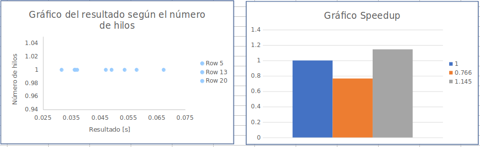
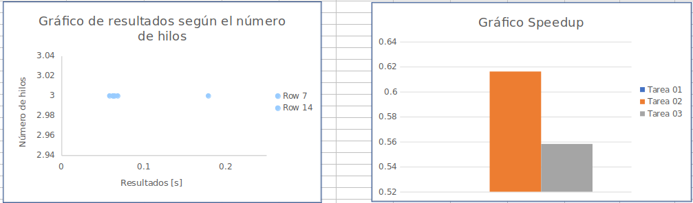
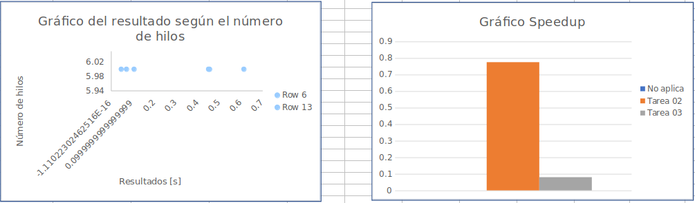
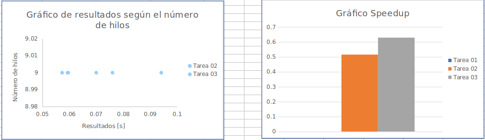

# Reporte

### Archivo tetris para las pruebas

```
1650259796944
12
20
10
0000000000
0000000000
0000000000
0000000000
0000000000
0000000000
0000000000
0000000000
0000000000
0000000000
0000000000
0001111000
0000040000
0004440000
0000700000
0007770000
0002200000
0020220000
0220066000
0777742244
14
I
Z
I
J
S
L
S
I
Z
I
J
S
L
S

```

### Resultados

* A. Usando un solo hilo (versión serial)

| Tarea           | Mejor Tiempo        | SpeedUp             |
|-----------------|---------------------|---------------------|
| Tarea 1         | 0.036038181s        |           1         |
| Tarea 2         | 0.047032499s        |         0.766       |
| Tarea 3         | 0.031469201s        |  1.145              |

* B. Usando un número de hilos igual al número de CPUs en la máquina que ejecuta el programa (máximo 16 hilos)

| Tarea           | Mejor Tiempo        | SpeedUp             |
|-----------------|---------------------|---------------------|
| Tarea 2         | 0.046441231s        |        0.775        |
| Tarea 3         | 0.449816702s        |  0.080              |

* C. Usando un número de hilos igual a la mitad del número de CPUs en la máquina que ejecuta el programa (máximo 8 hilos)

| Tarea           | Mejor Tiempo        | SpeedUp             |
|-----------------|---------------------|---------------------|
| Tarea 2         | 0.058487965s        |        0.6161       |
| Tarea 3         | 0.064563813s        |  0.55817            |

* D. Usando dos hilos por cada CPU en la máquina que ejecuta el programa (máximo 32 hilos)

Para esta tarea este caso de uso no se puede realizar ya que la tarea limita el numero de hilos de acuerdo a las columnas del tablero de juego, nuestro caso de uso contiene 10 columnas

* E. Usando un número de hilos igual a la cantidad de columnas del tablero de juego multiplicado por el número de rotaciones de la primera figura basándose en el archivo de entrada.

Para esta tarea este caso de uso no se puede realizar ya que la tarea limita el numero de hilos de acuerdo a las columnas del tablero de juego, nuestro caso de uso contiene 10 columnas

Se decide a utilizar el maximo de hilos para esta prueba

| Tarea           | Mejor Tiempo        | SpeedUp             |
|-----------------|---------------------|---------------------|
| Tarea 2         | 0.069935430s        |        0.5153       |
| Tarea 3         |  0.057286138s       |  0.629              |


### Gráficos

En la siguiente comparativa utilizamos 1 hilo, es decir la version seria los resultados fueron los siguientes:
En la tarea #01 los tiempos fueron los siguientes:

| Hilos           | Tiempo              |
|-----------------|---------------------|
| 1               | 0.036038181         |
| 1               | 0.036945317         |
| 1               | 0.049056329         |

En la tarea #02 los tiempos fueron los siguientes:

| Hilos           | Tiempo              |
|-----------------|---------------------|
| 1               | 0.047032499         |
| 1               | 0.057867294         |
| 1               | 0.067376366         |

En la tarea #03 los tiempos fueron los siguientes:

| Hilos           | Tiempo              |
|-----------------|---------------------|
| 1               | 0.031469201         |
| 1               | 0.036286867         |
| 1               | 0.053641616         |

Y por ende el speedup fue el siguiente:

| Tarea           | Mejor Tiempo        | SpeedUp             |
|-----------------|---------------------|---------------------|
| Tarea 1         | 0.036038181s        |           1         |
| Tarea 2         | 0.047032499s        |         0.766       |
| Tarea 3         | 0.031469201s        |  1.145              |



En la siguiente comparativa utilizamos 3 hilo, es decir la version concurrente los resultados fueron los siguientes:
En la tarea #1 no aplican

En la tarea #02 los tiempos fueron los siguientes:

| Hilos           | Tiempo              |
|-----------------|---------------------|
| 3               | 0.058487965         |
| 3               | 0.062490211         |
| 3               | 0.063110759         |

En la tarea #03 los tiempos fueron los siguientes:

| Hilos           | Tiempo              |
|-----------------|---------------------|
| 3               | 0.068377078         |
| 3               | 0.178990227         |
| 3               | 0.064563813         |

Y por ende el speedup fue el siguiente:

| Tarea           | Mejor Tiempo        | SpeedUp             |
|-----------------|---------------------|---------------------|
| Tarea 2         | 0.058487965s        |        0.6161       |
| Tarea 3         | 0.064563813s        |  0.55817            |



En la siguiente comparativa utilizamos 6 hilo, es decir la version concurrente los resultados fueron los siguientes:
En la tarea #1 no aplican

En la tarea #02 los tiempos fueron los siguientes:

| Hilos           | Tiempo              |
|-----------------|---------------------|
| 6               |0.046441231          |
| 6               | 0.105808688         |
| 6               | 0.070724465         |

En la tarea #03 los tiempos fueron los siguientes:

| Hilos           | Tiempo              |
|-----------------|---------------------|
| 6               | 0.449816702         |
| 6               | 0.454873672         |
| 6               | 0.613349046         |

Y por ende el speedup fue el siguiente:

| Tarea           | Mejor Tiempo        | SpeedUp             |
|-----------------|---------------------|---------------------|
| Tarea 2         | 0.046441231s        |        0.775        |
| Tarea 3         | 0.449816702s        |  0.080              |



En la siguiente comparativa utilizamos 9 hilo, es decir la version concurrente los resultados fueron los siguientes:
En la tarea #1 no aplican

En la tarea #02 los tiempos fueron los siguientes:

| Hilos           | Tiempo              |
|-----------------|---------------------|
| 9               |0.094061226          |
| 9               | 0.075957138         |
| 9               | 0.06993543          |

En la tarea #03 los tiempos fueron los siguientes:

| Hilos           | Tiempo              |
|-----------------|---------------------|
| 9               | 0.05929097          |
| 9               | 0.059518879         |
| 9               | 0.057286138         |

| Tarea           | Mejor Tiempo        | SpeedUp             |
|-----------------|---------------------|---------------------|
| Tarea 2         | 0.069935430s        |        0.5153       |
| Tarea 3         |  0.057286138s       |  0.629              |




### Conclusiones

Luego de realizar esta tarea y poner a prueba el rendimiento de las diferentes soluciones se concluye lo siguiente

* La solucion planeada en la tarea uno es la que mejor rendimiento posee, ya que al procesar los niveles de manera iterativa y de manera horizontal en vez de vertical , y obtiene la mejor posicion en cada nivel.
* En cambio al realizar la solucion paralela y concurrente se realiza mas procesamiento al crear y borrar los hilo.
